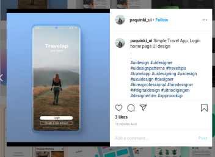
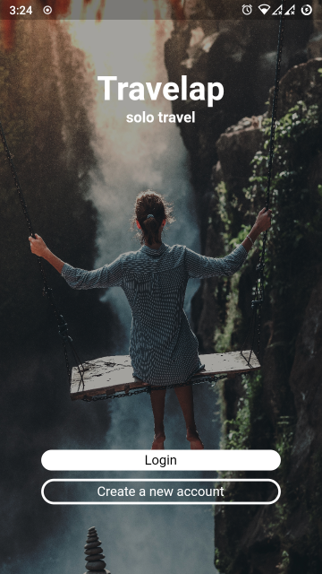
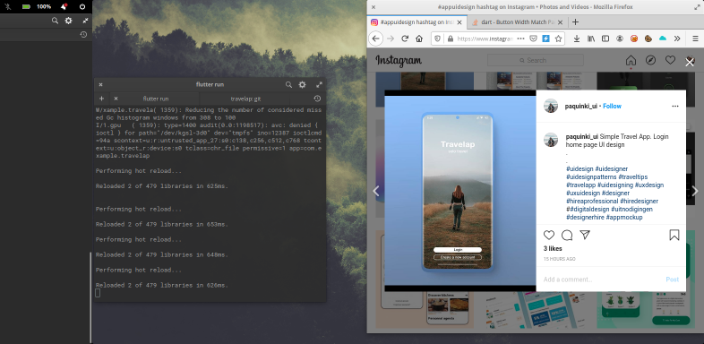
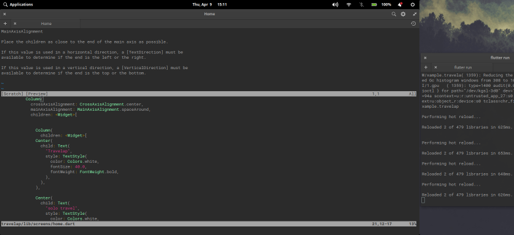

> What We Learn With Pleasure We Never Forget - Alfred Mercier

## (Flutter UI Pracitce Projects) 

> For practice projects, i pick random UI designs by UI/UX designers from Instagram, i try my level best to recreate the UI design in Dart & Flutter. The repo contains all the code and assets used, along with the app [apk release](https://github.com/VishnuDileesh/Travelap-FlutterUIPractice/blob/master/apk-release/travelapp-ui.apk). 

## [Travelap](https://www.instagram.com/p/B-ugAS2jCCx/) UI is designed by : [Paco Vaca](https://www.instagram.com/paquinki_ui/)

## UI Screenshot

## App UI Screenshot

## WIP Screenshot

## Assets Usage Credit

> [Photo](https://unsplash.com/photos/8AsKha7aIvk) by [Artem Beliaikin](https://unsplash.com/@belart84) on [Unsplash](https://unsplash.com/)

